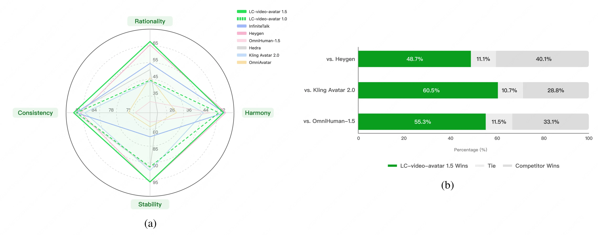

# LongCat-Video-Avatar 1.5

  

  
  
  
  

    
  

  

## 🔥 Latest News
* May 21, 2026: 🚀 We release [***LongCat-Video-Avatar-1.5***](https://meigen-ai.github.io/LongCat-Video-Avatar-1.5/), an upgraded open-source framework for audio-driven human video generation. v1.5 replaces Wav2Vec2 with Whisper-Large for more accurate lip synchronization, achieves production-ready physical rationality and temporal stability with robust long-video generation, generalizes to stylized domains (anime, animals, complex real-world conditions), supports both single-stream and multi-stream audio inputs, and accelerates inference to 8 steps via step distillation. [ [***code***](https://github.com/meituan-longcat/LongCat-Video) | 🤗 [***weights***](https://huggingface.co/meituan-longcat/LongCat-Video-Avatar-1.5) | [***project page***](https://meigen-ai.github.io/LongCat-Video-Avatar-1.5/) ]

## ✨ Key Features
- **Upgraded Audio Encoder (Whisper-Large)**: Replaces Wav2Vec2 with Whisper-Large, yielding significantly smoother and more natural lip dynamics.
- **Production-Ready Stability**: Achieves accurate lip-synchronization, full-body temporal stability, and robust long-video generation with strict identity consistency.
- **Stylized Domain Generalization**: Robustly generalizes to anime, animals, and complex real-world conditions such as multi-person interactions and object handling.
- **Efficient 8-Step Inference**: Advanced DMD2-based step distillation accelerates inference to 8 NFE, balancing cost-effective serving with exceptional visual fidelity.

## 📊 Human Evaluation
We introduce a comprehensive human evaluation benchmark specifically tailored for audio-driven digital human generation. The benchmark encompasses 6 application scenarios (News Broadcasting, Knowledge Education, Daily Life, Entertainment, Singing, Commercial Promotion), 2 languages (Chinese/English), and 2 visual styles (Realistic/Animated), yielding a total of 508 image-audio source pairs.

Evaluation Methodology: (1) Subjective Track: 770 crowdsourced evaluators rated each generated video on a 1-5 human-likeness scale, yielding 13,240 judgments. (2) Objective Track: 10 domain experts conducted structured quality analysis across four dimensions: Physical Rationality, Harmony (Audio-Visual Coordination), Temporal Stability, and Identity Consistency. The results are shown in the following figure: (a) Expert-level objective quality evaluation across four dimensions. (b) Subjective human-likeness comparison with leading commercial models.

  

